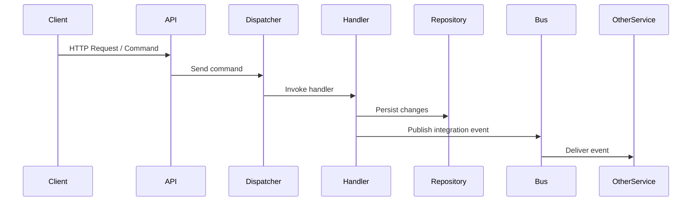

# Meadow Framework

A small, opinionated .NET library that wires MediatR-style dispatching, MassTransit (RabbitMQ) integration and a set of DDD primitives (AggregateRoot, Repository, UnitOfWork, ValueObject) to accelerate building maintainable, distributed applications.

> Lightweight building blocks for domain-driven applications, messaging and application-level dispatching.

Table of Contents
- Overview
- Key features
- Prerequisites
- Quick start
- Configuration
- Usage examples
  - Command + Handler
  - Publishing integration events
  - Repository + Unit of Work
- Registered services
- Architecture (sequence)
- Contributing
- Development
- License

Overview

This repository provides a reusable set of abstractions, DI wiring and integrations commonly used in microservice-style .NET projects:
- Application-level dispatchers and handler discovery (command / query / event handlers)
- MassTransit integration with RabbitMQ for integration events
- DDD primitives (AggregateRoot, EntityBase, ValueObject, Repository, UnitOfWork)
- Outbox support and basic exception / API problem handling middleware

The goal is to reduce boilerplate and let teams focus on domain logic and message flows.

Key features
- Automatic DI registration (scan assembly and register command/query/event handlers)
- MediatR-style dispatching via `IDispatcher` / `IQueryDispatcher` / `ICommandDispatcher`
- Integration events publishing with MassTransit (RabbitMQ)
- DDD primitives and repository/unit-of-work abstractions
- Exception middleware and API problem details helpers

Prerequisites
- .NET 6+ SDK (examples use the minimal host style)
- (Optional) RabbitMQ instance for MassTransit

Quick start

Register the framework when building your host (example for .NET 6+ minimal hosting):

```csharp
using Framework.Infrastructure; // adjust namespace if different

var builder = WebApplication.CreateBuilder(args);

// register the framework and scan the current assembly (or pass any assembly that contains handlers)
builder.Services.AddFramework(builder.Configuration, typeof(Program).Assembly);

var app = builder.Build();
app.UseMiddleware<Framework.Infrastructure.ErrorHandlerMiddleware>(); // optional, if present
app.MapControllers();
app.Run();
```

Notes:
- The example assumes an extension method `AddFramework(IConfiguration, Assembly)` is exposed by the library. If your project uses a different type or assembly for discovery, pass that assembly instead.

Configuration

A minimal `appsettings.json` example with RabbitMQ settings consumed by MassTransit integration:

```json
{
  "MassTransit": {
    "Host": "rabbitmq://localhost",
    "Username": "guest",
    "Password": "guest",
    "VirtualHost": "/"
  },
  "ConnectionStrings": {
    "DefaultConnection": "Server=.;Database=MyDb;Trusted_Connection=True;"
  }
}
```

Usage examples

Command + handler (example)

```csharp
// command (record or class)
public record CreateOrderCommand(Guid OrderId, decimal Total);

// handler (implements the framework's abstraction)
public class CreateOrderHandler : ICommandHandler<CreateOrderCommand, Result>
{
    private readonly IRepository<Order> _orders;
    public CreateOrderHandler(IRepository<Order> orders) => _orders = orders;

    public async Task<Result> Handle(CreateOrderCommand request, CancellationToken ct)
    {
        var order = Order.Create(request.OrderId, request.Total);
        await _orders.AddAsync(order, ct);
        await _orders.UnitOfWork.SaveChangesAsync(ct);
        return Result.Success();
    }
}
```

Publishing integration events (MassTransit)

```csharp
public class OrderCreatedEvent
{
    public Guid OrderId { get; init; }
    public decimal Total { get; init; }
}

public class SomeService
{
    private readonly IPublishEndpoint _publisher;
    public SomeService(IPublishEndpoint publisher) => _publisher = publisher;

    public Task PublishOrderCreated(Guid orderId, decimal total) =>
        _publisher.Publish(new OrderCreatedEvent { OrderId = orderId, Total = total });
}
```

Repository + Unit of Work (conceptual)

```csharp
// obtain via DI
IRepository<Order> orders = ...;
var order = await orders.GetAsync(orderId);
order.ApplyDomainEvent(new SomethingHappened(...));
await orders.UnitOfWork.SaveChangesAsync();
```

Registered services

When you call `AddFramework(...)`, the library will register (examples — adjust to actual project API):

- Dispatchers / helpers
  - IDispatcher
  - ICommandDispatcher
  - IQueryDispatcher
  - IEventDispatcher
- Handler registrations (open or concrete)
  - ICommandHandler<TCommand, TResult>
  - IQueryHandler<TQuery, TResult>
  - IEventHandler<TEvent>
  - INotificationHandler<TNotification> (if MediatR is used)
- Repository / Persistence abstractions
  - IRepository<T>
  - IUnitOfWork
  - IOutboxRepository (if outbox is implemented)
- Middleware
  - ErrorHandlerMiddleware / ExceptionMiddleware (API problem mapping)

Core components
- EntityBase, AggregateRoot, ValueObject
- Specification and SpecificationEvaluator
- OutboxMessage and Outbox message state
- Mapping abstractions and common DTO helpers

Architecture (sequence)



Contributing
- Open issues or PRs with a clear description and small, focused changes.
- Add unit tests for new behavior where applicable.
- Follow existing code style and run local builds before submitting.

Development
- Build: `dotnet build`
- Run tests (if present): `dotnet test`
- Linting / static analysis: follow repository CI configuration (if any)

If you add new handlers or domain types, ensure the assembly that contains them is included when calling `AddFramework(...)` so the DI scanner can discover and register handlers.

License

Specify a license for the repository (e.g., MIT). Add a `LICENSE` file at the repository root and update this section accordingly.

Contact
For questions or contributions, open an issue in this repository or contact the maintainers listed in the project metadata.
